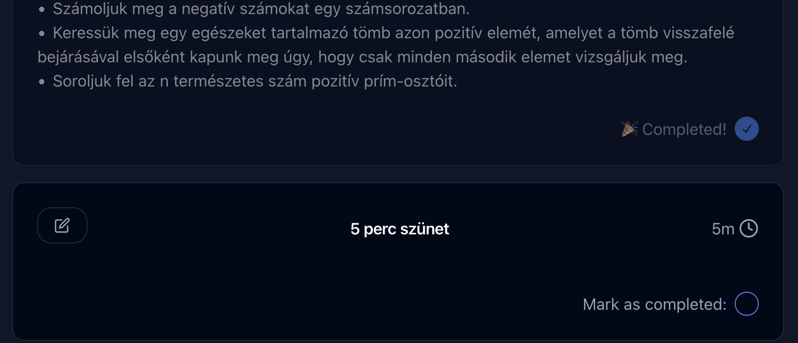
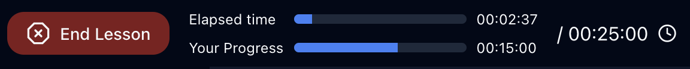

# Óravázlat app felhasználói dokumentáció

(Word fájlból generálva)

A Studio egy olyan alkalmazás, amely jelentősen megkönnyíti a tanárok
munkáját az órák előkészítése és megtartása során, miközben egyszerűbbé
teszi a hallgatók bevonását a tanítási folyamatba. Az alkalmazás
egyedülálló modularitása lehetőséget biztosít egy fenntartható
tudásbázis kialakítására.

## 1. Az alkalmazás funkciói

### 1. Blokkok létrehozása

A felhasználók képesek blokkokat létrehozni, amelyek meghatározott
időtartammal, címmel és tartalommal rendelkeznek. Ezek a blokkok az
óravázlatok alapkövei, amelyek számos szemantikus elemet -- képek,
linkek, címek, felsorolások -- támogatnak. A felhasználó blokkjai
tekinthetők az ő személyes feladatgyűjteményének. Például, ha egy oktató
rendelkezik egy hasznosnak ítélt példával vagy feladattal, azt
egyszerűen elmentheti egy blokkba, hozzárendelheti, hogy mennyi időt
érdemes rászánni egy tanórán, majd az óravázlatok különböző verzióiban
újra és újra felhasználhatja. Ez nem csak az időt takarít meg, hanem egy
konzisztens, jól átgondolt tananyag kialakítását is lehetővé teszi.

### 2. Óravázlatok összeállítása

Az óravázlatokat a felhasználók drag and drop módszerrel állíthatják
össze a megadott óravázlat szerkesztői felületén, ahol egy blokkot
többször is felhasználhatnak az óravázlat összeállításához. Egy
óravázlat időtartamát a benne lévő blokkok időtartamának összege
határozza meg. Testre szabható a címe, valamint blokkok, fájlok,
interaktív hallgatói jegyzetek rendelhetőek hozzá.

#### 1. _Fájlok csatolása az óravázlatokhoz_

Azok a tanárok, akik hozzáférnek az adott óravázlathoz, dokumentumokat,
képeket és egyéb médiafájlokat csatolhatnak az óravázlatokhoz. Ez a
funkció elősegíti a prezentációk, feladatlapok, kiegészítő anyagok
hozzárendelését egy-egy tanórához.

#### 2. _Interaktív hallgatói jegyzet hozzárendelése az óravázlatokhoz_

Az oktatók a hallgatók számára interaktív, CodeSandbox alapú
Javascriptes projekteket állíthatnak össze, amelyek az óravázlatokhoz
vannak hozzárendelve. Ezek a projektek a böngészőn belül futtathatóak és
szerkeszthetőek, így -- amennyiben webprogramozással kapcsolatos a
tananyag -- elősegítik a közös munkát a tanóra alatt, illetve az adott
tananyaghoz tartozó jegyzet megosztását a hallgatósággal.

### 3. Csoportok létrehozása

Az alkalmazás lehetővé teszi csoportok létrehozását, amelyekhez az
oktatók email alapján adhatnak hozzá új tagokat. Óravázlatokat kizárólag
csoportokon keresztül oszthatnak meg egymással a tanárok.

### 4. Óratartás mód

Az alkalmazás további fontos funkciója az \"óratartás mód\", amely
vizuálisan reprezentálja a ténylegesen eltelt idő és az óratartás
előrehaladásának viszonyát, ezzel segítve az oktatót az
időmenedzsmentben.

## 2. Az alkalmazás használata

Ahogyan az a webes alkalmazásokra jellemző, a felhasználó különböző
oldalak közötti navigálás révén használhatja a weboldalt. Ebben a
fejezetben az alkalmazás elérhető útvonalain található oldalak tartalmát
mutatom be.

### 1. Nyitóoldal

Amikor a felhasználók először látogatnak el az oldalra, a nyitóoldal
(ún. landing page) fogadja őket, ahol megismerkedhetnek az alkalmazás
legfontosabb jellemzőivel és előnyeivel. Ezen az oldalon található a
bejelentkezési lehetőség is, amelyre kattintva a látogatók egy új
oldalra kerülnek, ahol bejelentkezhetnek a felhasználójukba. A
nyitóoldal célja, hogy megnyerő módon mutassa be az alkalmazás
működését, és segítse a felhasználókat a bejelentkezési folyamatban.

Amennyiben az oldalra látogató felhasználó már rendelkezik azonosított
munkamenettel, a rendszer automatikusan a vezérlőpultjához irányítja át,
ahol már minden funkció elérhető számára.

Útvonal: /

### 2. Bejelentkezési oldal

A bejelentkezési oldalon a felhasználóknak lehetőségük nyílik
bejelentkezni vagy új felhasználóként regisztrálni egyetlen
gombnyomással, amennyiben rendelkeznek GitHub fiókkal. A \"Sign in with
GitHub\" gombra kattintva az új felhasználók gyorsan létrehozhatják
saját felhasználói fiókjukat, míg a már regisztrált felhasználók
azonosíthatják magukat és hozzáférhetnek a szolgáltatásokhoz.

A bejelentkezési folyamat biztonságát a GitHub rendszere garantálja, így
a felhasználóknak nem szükséges külön jelszóval rendelkezniük az
alkalmazás használatához. Amennyiben a felhasználónak még nincsen
regisztrált GitHub fiókja, az ingyenesen igényelhet a GitHub weboldalán,
a [https://github.com/join](https://github.com/join)
címen. Az első bejelentkezés alkalmával a Studio eltárolja a felhasználó
által a GitHub profilján megadott e-mail címét, nevét, és profilképének
elérési útvonalát.  Sikeres bejelentkezés esetén a rendszer a
felhasználót automatikusan átirányítja a vezérlőpultjához, ahol már
minden funkció elérhető számára.

Útvonal: /api/auth/signin

### 3. Vezérlőpult oldal

A bejelentkezés után a felhasználókat az áttekinthető vezérlőpult oldal
fogadja, ahol összefoglalva láthatják az óráikhoz és tananyagaik
számosságához kapcsolódó információkat. A vezérlőpult központi elemei az
összefoglaló kártyák, amelyek mindegyike rendelkezik egy navigációs
linkkel, illetve információkkal, amelyek segítenek a felhasználóknak
nyomon követni a munkájuk előrehaladását. Innen minden listaoldal, ahol
megjelenítésre kerülnek a felhasználó által elérhető csoportok,
óravázlatok és a blokkok, egy gombnyomással elérhető. A vezérlőpulton
való navigálás intuitív és felhasználóbarát, lehetővé téve a
felhasználók számára, hogy gyorsan és hatékonyan kezeljék a felületet.

Útvonal: /dashboard

### 4. Csoportok listaoldala

 

A tantárgycsoportok listaoldalán a
felhasználók egyszerűen megtekinthetik azokat a csoportokat, amelyeknek
tagjai. Az egyes csoportok kártyák formájában kerülnek listázásra.
Minden kártyán látható az adott csoport ikonja, a csoport neve, valamint
a tagjainak száma, ezáltal információkat biztosítva a csoport jellegéről
és nagyságáról. A kártyákhoz tartozó \'Megtekint\' linkre kattintva a
felhasználó közvetlenül az adott csoport oldalára navigálhat. Amennyiben
egy csoport tulajdonosa a felhasználó, úgy további lehetőségek is
megjelennek a kártyán: szerkesztés és törlés gomb, amelyek segítségével
egy felugró ablakban változtathat a csoport alapinformációin, illetve
szükség esetén törölheti a csoportot.

Útvonal: /groups

### 5. Csoportoldal

A csoportoldalon a felhasználók információkat találnak a kiválasztott
csoportról, és innen férhetnek hozzá a csoporttagok által megosztott
tananyagokhoz. Megjelenik a csoport ikonja, neve és leírása. A
csoportokhoz tartozó óravázlatok egy listában láthatók, amelyben az
óravázlatok címe mellett a listaelemek tartalmaznak egy navigációs
linket az óravázlat oldalára, illetve az óravázlat szerzőjének
profilképét. A csoport bármely tagja adhat hozzá óravázlatot, illetve
eltávolíthatja egy korábban hozzáadott óravázlatát. A tagok listája is
elérhető ezen az oldalon, ahol minden csoporttag nevét és profilképét
láthatjuk listába szedve, illetve \"Tulajdonos\" jelölő jelenik meg az
adott tag listaelemén, amennyiben ő a csoport tulajdonosa. A csoport
tulajdonosa ezen az oldalon vehet fel, illetve törölhet tagokat. A
tulajdonos számára elérhető a \"Szerkesztés\" gomb is, amellyel
módosíthatja a csoport címét, frissítheti a leírását vagy választhat
másik ikont a \"Csoport szerkesztése\" felugró ablak segítségével.

### 6. Óravázlatok listaoldala

Ezen az oldalon a felhasználó által létrehozott óravázlatok jelennek meg
egy vertikális listában, ahol mindegyik listaelem tartalmazza az adott
óravázlat címét, az óravázlat teljes időtartamát, valamint a benne
található blokkok számát. A lista minden eleme mellett egy törlés ikon
is található, amellyel a felhasználók véglegesen kitörölhetik az adott
óravázlatot. Az egyes óravázlatok címére kattintva közvetlenül az adott
óravázlat oldalára léphetünk. Az \"Óravázlat hozzáadása\" gomb
segítségével új óravázlatot adhat hozzá a felhasználó.

Útvonal: /lessons

### 7. Óravázlat oldal

Az óravázlat részletes oldalának elrendezése két fő szekcióra oszlik,
melyek között fülek segítségével váltogathatunk, hogy a blokkok és
csatolmányok között navigálhassunk.

Útvonal: /lessons/\<óravázlat univerzálisan egyedi azonosítója\>

#### 1. _Óravázlat fül_

Az Óravázlat részen megjelennek az
óravázlathoz tartozó blokkok, illetve a blokkok listája felett két
navigációs gomb is helyet kap, amelyekkel az adott óravázlat szerkesztői
felületére, illetve az adott óravázlathoz tartozó hallgatói jegyzet
szerkesztői felületére navigálhatunk.

Az óra részeit képező blokkok egy rendezett listában jelennek meg,
minden egyes blokkban megjelenik az adott blokk címe, időtartama és
tartalma. Ha az adott óravázlatot a felhasználó készítette, a blokkokon
egy szerkesztés gomb jelenik meg, ami lehetővé teszi a tananyag további
finomítását.

Amennyiben az \"óratartás mód\" aktív, a felhasználó egy jelölőnégyzet
segítségével jelezheti, ha az adott blokkot már feldolgozta az aktuális
órán. Amennyiben a jelölőnégyzet be van pipálva, úgy az óratartás mód
alatt a blokk átlátszóvá válik, ami segít a felhasználónak
összpontosítani a még hátralévő részekre.

Ha egy blokkot késznek jelölünk, az az
előrehaladást is növeli, amelynek értékét a navigációs sávban található
\"előrehaladás-jelző sávon\" követhet figyelemmel.

#### 2. _Csatolmányok fül_

A Csatolmányok részen a felhasználók
dokumentumokat, képeket és egyéb médiafájlokat csatolhatnak az
óravázlathoz.

A \"Csatolmány feltöltése\" gomb megnyomása során felugró ablakban drag
and drop módszer vagy az operációs rendszer tallózás funkciójának
segítségével a felhasználók könnyedén hozzáadhatnak prezentációkat és
kiegészítő anyagokat az óravázlathoz.

A feltöltött csatolmányok listában
kerülnek megjelenítésre, minden elem tartalmazza a fájl előnézetét,
méretét, a feltöltés idejét, információkat a feltöltő személyről,
valamint gombot. A törlés funkció akkor jelenik meg, ha a felhasználó
maga töltötte fel az adott fájlt, vagy az adott felhasználó az óravázlat
tulajdonosa.

### 8. Óravázlat szerkesztése oldal

Az Óravázlat szerkesztése oldal egy kulcsfontosságú része a
webalkalmazásnak, amely lehetővé teszi az óravázlatok moduláris
összeállítását az előre definiált blokkokból. Ezen az oldalon két fő
terület jelenik meg: bal oldalon a felhasználó által létrehozott blokkok
sorakoznak, míg jobb oldalon, a kiválasztott blokkoknak foglalnak helyet
a felhasználó által definiált sorrendben.

Útvonal: /lessons/\<óravázlat univerzálisan egyedi azonosítója\>/edit

A bal oldali téglalap formájú területen a
felhasználó azokat a blokkokat találja, amelyeket hozzáadhat az
óravázlathoz. Ezeket a blokkokat egyszerűen áthelyezhetik a jobb oldali
téglalapba a drag-and-drop módszer segítségével, ezzel átmásolva őket az
óravázlatukhoz (egy blokkot többször is hozzá lehet adni a kiválasztott
blokkokhoz). Ez a folyamat intuitív és gyors, lehetővé téve a
felhasználók számára, hogy könnyedén alakítsák ki óravázlataikat.

A jobb oldali téglalapban a kiválasztott
blokkok szabadon rendezhetőek. A felhasználók módosíthatják a blokkok
sorrendjét, vagy eltávolíthatják őket az óravázlatból, amennyiben
szükséges.

Az oldalon elhelyezett \"Változtatások mentése\" gomb biztosítja, hogy a
felhasználók menteni tudják az óravázlat blokkjain végrehajtott
változtatásokat. A mentés után a rendszer visszavezeti őket az
óravázlatokat listázó oldalra, ahol az újonnan mentett óravázlat azonnal
a módosított formában jelenik meg.

### 9. Hallgatói jegyzet szerkesztése oldal

Amennyiben még nincs hallgatói jegyzet rendelve az adott óravázlathoz, a
felhasználó kiválaszthatja a kívánt sablont modern webes keretrendszerek
közül, vagy akár betölthet egy Vanilla Javascript projektet is.

Útvonal: /lessons/\<óravázlat univerzálisan egyedi
azonosítója\>/edit/handout

A Hallgatói jegyzet létrehozása gombra kattintva a
felhasználók létrehozhatják a hallgatói jegyzet alapját, ami egy
kiinduló mappaszerkezetet biztosít számukra. Ezt a struktúrát a
felhasználók tetszés szerint alakíthatják és testre szabhatják, majd
elmenthetik a kész jegyzetet. Amennyiben más alapstruktúrát szeretnének
betölteni, úgy a \"Hallgatói jegyzet visszaállítása\" gombbal törölhetik
az aktuális hallgatói jegyzetet.

Ha az óravázlat már elkészült, az oldal
alján megjelenik egy \"Megosztás\" szekció, ahol a tanárok ki tudják
másolni a hallgatói jegyzethez tartozó publikus URL-t. Ezt a linket
megoszthatják a diákokkal, akik így hozzáférhetnek az interaktív
hallgatói jegyzethez.

### 10. Blokkok listaoldala

Az oldalon egy vertikális kialakítású rendezetlen lista található, amely
a felhasználó által létrehozott blokkokról tartalmaz információkat,
illetve egy \"Új hozzáadása\" gomb, amely a felhasználót az \"Új blokk
létrehozása\" oldalra navigálja.

Útvonal: /blocks

A felhasználó által létrehozott összes blokk listázva van az oldalon.
Minden listaelem tartalmazza a blokk címét, az időtartamát, valamint egy
törlés gombot. A blokk címére kattintva a felhasználó az adott blokk
oldalára navigálhat.

A törlés gomb segítségével a felhasználó véglegesen törölheti azokat a
blokkokat, amelyek már nem szükségesek vagy elavultak, így karbantartva
az általa létrehozott tudásbázist.

### 11. Új blokk létrehozása oldal

Az oldal egy egyszerű, mégis hatékony űrlapot tartalmaz, amelyen
keresztül a felhasználók megadhatják az új blokk alapvető adatait.

Útvonal: /blocks/new

Az első mező egy szöveges bemeneti mező, ahova a felhasználó beírhatja
az új blokk címét. A blokk időtartamát egy csúszka segítségével lehet
beállítani, a tartalom megadásához pedig egy \"What You See Is What You
Get\" (WYSIWYG) szövegszerkesztő áll rendelkezésre. Ez azt jelenti, hogy
a felhasználó közvetlenül látja, hogyan fog megjelenni a tartalom,
miközben azt szerkeszti. A szövegszerkesztő képes már elkészült markdown
fájlok importálására is, ezt a funkciót a szerkesztőn belül megjelenő
környezeti menü segítségével érhetjük el.

Miután a felhasználó elkészült a blokk
definiálásával, a mentés gombra kattintva elmentheti az új blokkot.
Mentés után az alkalmazás automatikusan átnavigálja őket a blokklista
oldalra, ahol megtekinthetik az újonnan létrehozott blokkot a többi
blokk között.

### 12. Blokk oldal

Az oldal tetején a blokk címe látható, mellette pedig a \"Szerkesztés\"
gomb, amely lehetővé teszi a felhasználó számára, hogy módosítsa a blokk
adatait.

A blokk tartalma \"előállítva\" jelenik meg, ami azt jelenti, hogy a
felhasználók pontosan úgy látják a tartalmat, ahogyan az az óravázlatban
is meg fog jelenni. Ez az oldal abban segít a felhasználónak, hogy
megtekintheti, hogyan fog kinézni a blokk az óravázlatok részeként.

Útvonal: /blocks/\<blokk univerzálisan egyedi azonosítója\>

###13. Blokk szerkesztése oldal

A blokk szerkesztése egy ugyanolyan űrlap segítségével történik, mint az
új blokk létrehozása. (Lásd: Új Blokk létrehozása) A \"Blokk
szerkesztése\" oldal betöltésekor az űrlap megjeleníti a blokk aktuális
adatait és tartalmát, és az űrlapelemek (szöveges beviteli mező,
csúszka, WYSIWYG szövegszerkesztő) segítségével szerkesztheti a blokkot,
majd elmentheti változtatásait a \"Változtatások mentése\" gomb
segítségével.
